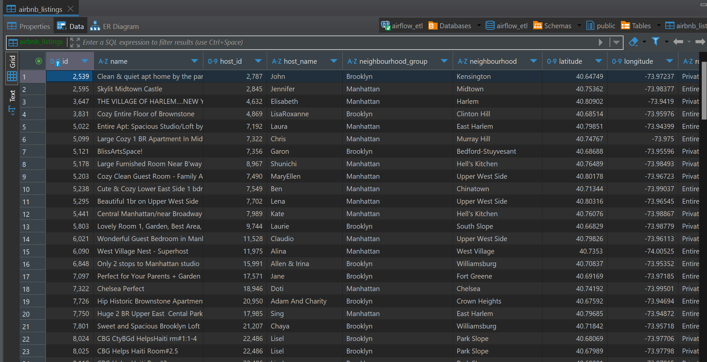

# How to run airflow:
1. Build image:
```shell
docker build . --tag extending_airflow:latest
```
2. Run docker-compose 
```shell
docker-compose up -d --build
```
3. Login to the web interface (use **airflow** as login and password) and create Postgres connection with proper params:
`user: airflow_etl`, `password: airflow_etl`, `port:5432` `connection id: airflow_etl_postgres`, `host: localhost` or 
`host.docker.internal` for Windows.
4. Run pipeline and check DB data.

Result of the run:


Data in DB:


Notes:
1. Table structure was changed due to incorrect definition for `reviews_per_month` field, changed to `DECIMAL`
2. Saving data from pandas to xcom as defined in requirements is a *really bad* solution therefore extract and transform
steps should actually be one.
3. Usage of PostgresOperator to load data is a *bad solution* without any workarounds like sharing the same data to 
postgres container. `pandas.to_sql()` should be used in such approach or `PythonOperator` with any other possible lib
like `psycopg`.
4. Error handling *task 8* is poorly written and not understandable.
5. Functions should be in other module.
6. Tests should be a requirement for functions.
7. Any parallel execution *shouldn't be done for this one*, other optimizations described above.
