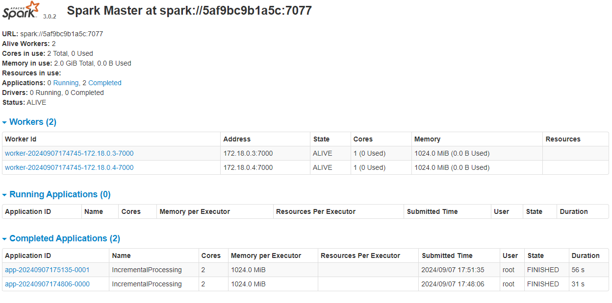

## How to run:

1. Build docker image using

```shell
docker build -t cluster-apache-spark:3.0.2 .
```

2. Run docker-compose

```shell
docker-compose up
```

3. Go to http://localhost:9090/ and check whether workers are running

4. Connect to docker master container using:

```shell
docker exec -it spark_practical_task-spark-master-1 /bin/bash
```

5. Place raw file to `./raw` folder

6. Inside container run:

```shell
/opt/spark/bin/spark-submit --master spark://spark-master:7077 /opt/spark-apps/etl_app.py
```

7. Go to http://localhost:9090/ and check whether it's running.
   Check each worked data:
   http://localhost:9091/
   http://localhost:9092/
8. Check results in `./processed` folder:

- `merged` folder contains merged data from multiple runs
- `partitioned` folder contains partitioned data by `neighbourhood_group`.
- `logs.log` contains all run logs.
- `processed_files.log` contains list of processed files.
  Result of processing 2 jobs:
  
  For more info see [logs.log](./processed/logs.log)

## Notes:

1. Step 2 is written badly, it's unclear how to achieve it and even impossible because it doesn't support required API
   for step 4, see https://spark.apache.org/docs/latest/structured-streaming-programming-guide.html#supported-queries.
   Also, it's unclear what is meant by `Micro-Batch Processing` as well as how to make it running continuosuly.
2. For step 4 it's unclear what to do with result.
3. Step 5 conflicts with step 2, and it's unclear how merged data should be stored.
4. For step 6 no info about how to get expected count.